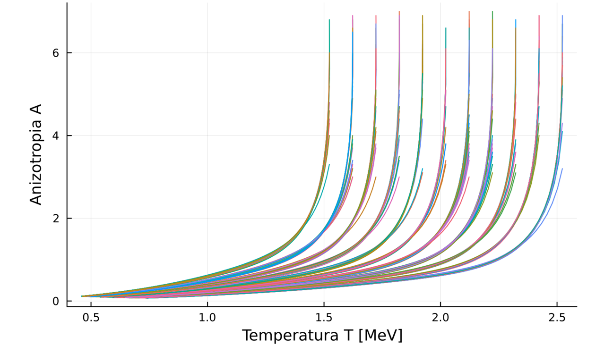
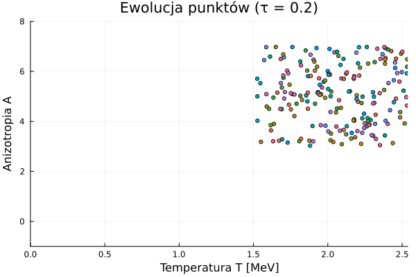

# Dzień dobry 


## Hydrodynamic Attractors in Phase Space
Michał Spaliński, Michał P. Heller, et al...

>Hydrodynamic attractors have recently gained prominence in the context of early stages of ultrarelativistic heavy-ion collisions at the RHIC and LHC. We critically examine the existing ideas on this subject from a phase space point of view. In this picture the hydrodynamic attractor can be seen as a special case of the more general phenomenon of dynamical dimensionality reduction of phase space regions. We quantify this using principal component analysis.
[link do pracy ](https://www.researchgate.net/publication/345364690_Hydrodynamic_Attractors_in_Phase_Space)


## youtube
[link do zapytaj fizyka z helerem](https://www.youtube.com/watch?v=6R2ASA7-g-c&t=9s)

## Źródło różnic w rozwiązaniach równania $A(w)$
[mis_vs_brsss](notes/mis_vs_brsss.md)


## Julia
czego potrzeba do pracy z julia? 
1. [Julia](https://julialang.org/downloads/)
2. Instalowania pakietów w menadżerze pakietów julia (REPL) poprzez wpisanie `]` i potem `add` oraz nazwy pakietu.
```bash
add DifferentialEquations Plots LaTeXStrings
```
3. Ważne by uruchamiać julia w terminal
```bash 
> julia
> include("nazwa_pliku.jl")
```
Procedura używania REPL (Read-Eval-Print Loop) w julia jest następująca:
```bash
include("modHydroSim.jl")
using .modHydroSim

# --- Eksperyment 1: Szybki test z domyślnymi ustawieniami ---
# Tworzysz obiekt ustawień bez podawania argumentów - użyje domyślnych.
settings1 = SimSettings() 
result1 = run_simulation(PARAMS_MIS_TOY_MODEL, settings1);
create_log_ratio_animation(result1, filename="run_default.gif")


# --- Eksperyment 2: Dłuższa ewolucja dla modelu SYM ---
# Tworzysz obiekt ustawień, nadpisując tylko czas końcowy.
settings2 = SimSettings(τ_end=2.5) 
result2 = run_simulation(PARAMS_SYM_THEORY, settings2);
create_log_ratio_animation(result2, filename="run_sym_long.gif")


# --- Eksperyment 3: Więcej punktów, inny zakres temperatur ---
settings3 = SimSettings(n_points=500, T_range=(400.0, 800.0))
result3 = run_simulation(PARAMS_SYM_THEORY, settings3);
create_log_ratio_animation(result3, filename="run_sym_dense_hot.gif")

```

### Programy napisane w julia 
Programy napisane w julia znajdują się w katalogu [src](/src/).

- [Generowanie danych](src/data_generation/generowanie_AiT.jl) - program generujący ewolucję $A(\tau)$ i $T(\tau)$ dla  warunków początkowych. do pliku .csv
- [Generowanie Danych logarytmicznych](src/data_generation/log_gen.jl) - program generujący ewolucję $A(\tau)$ i $T(\tau)$ dla  warunków początkowych. do pliku .csv w skali logarytmicznej.

- [Analiza wygenerowanych danych](src/trash_can/A_and_T_evolution.jl)

- [Analiza losowo generowanych Danych ewolucji (A,T)](src/trash_can/Evolution2.jl) 
> staram się by nie trzebas było omawiać dodatkowo kodu i wszystko było jasne z komentarzy ale jak coś to zapraszam do kontaktu. 
`
## Wygenerowane wykresy
Wszystkie rysunki i wykresy wygenerowane przez kod bede starał się umieszczać w katalogu [images](/images/). Jeśli nie będzie tak żadnego wykresu to zalecam sprawdzenie katalogu [src](/src/) gdzie powinny być wygenerowane wykresy których jeszcze nie przeniosłem. 

## Raport 
### 19.07.2025
- [Evolution of A and T](src/trash_can/Evolution2.jl) - program do generowania ewolucji $A(\tau)$ i $T(\tau)$ dla losowych warunków początkowych.
-  

<details open>
<summary><strong>⚠️ UWAGA</strong></summary>

<p><strong>WYŻEJ ZAMIESZCZONY GIF BAZUJE NA BŁĘDNYCH DANYCH</strong></p>

</details>


### 24.07.2025
```julia
julia> include("modHydroSim.jl")
Main.modHydroSim

julia> using .modHydroSim

julia> settings1 = SimSettings()
SimSettings(200, 0.2, 1.2, (0.2, 1.2), (300.0, 500.0), (0.0, 4.0))

julia> settings2 = SimSettings(T_range(1.0,2.0))
ERROR: UndefVarError: `T_range` not defined in `Main`
Suggestion: check for spelling errors or missing imports.
Stacktrace:
 [1] top-level scope
   @ REPL[4]:1

julia> settings2 = SimSettings(T_range=(1.0,2.0))
SimSettings(200, 0.2, 1.2, (0.2, 1.2), (1.0, 2.0), (0.0, 4.0))

julia> result_default = run_simulation(PARAMS_MIS_TOY_MODEL, settings1);
--- Rozpoczynanie Obliczeń Numerycznych...
--- Obliczenia Zakończone. ---

julia> create_log_ratio_animation(result_default, filename= "testowy.gif")
Generowanie animacji: testowy.gif...
```
Już po nauczeniu się obsługi REPL. [program modHydroSim.jl](/src/modHydroSim.jl) jest gotowy do użycia. Wystarczy go załadować i można korzystać z funkcji `run_simulation` oraz `create_log_ratio_animation` i innych.


**Wykresy i zdjęcie**
- 

- 

## **[HINTON_SNE](neural_networks/sne.pdf)** Implementacja Algorytmu SNE do badania dynamiki regukcji wymiarowości
Algorytm SNE (Stochastic Neighbor Embedding) jest używany do redukcji wymiarowości danych. W kontekście badania dynamiki redukcji wymiarowości, implementacja tego algorytmu może być przydatna do analizy danych z symulacji hydrodynamicznych m.in 
takich których wyniki widoczne są w [Symulacja Ewolucji A i T](images/A_T/27.07.2025.gif) Gdzie dokładnie wydać jak zmienia się dynamika (tempo redukcji wymiarowości do z 2d do 1d)  w czasie.

- **Kod z implementacją tego Algorytmu jest umieszczony** -> [kod_sne](src/sne.jl)

*Jak używać w REPL?*

```bash 
> julia
> ]
> pkg > activate . # aktywacja środowiska, jeśli jest w katalogu
> include("lib.jl")
> using .modHydroSim
# opcjonalnie ja osobiście używam using Revise by móc modyfikować kod bez restartowania REPL
#albo po prostu 
> include("sne.jl")
```


## PCA 


```bash
julia> include("pca.jl")
WARNING: replacing module modHydroSim.
WARNING: using modHydroSim.MeV in module Main conflicts with an existing identifier.
WARNING: using modHydroSim.SimSettings in module Main conflicts with an existing identifier.
WARNING: using modHydroSim.run_simulation in module Main conflicts with an existing identifier.
🔬 ANALIZA PCA TRAJEKTORII HYDRODYNAMIKI
==================================================
--- Krok 1: Generowanie danych z symulacji hydrodynamiki... ---
--- Krok 2: Przekształcanie trajektorii w wektory wysokowymiarowe... ---
Trajektoria 1: T0=1.429390442162698, początek wektora: [1.429390442162698, 2.232601031372945, 1.3570725751702735, 1.9708050172587508, 1.2982109634311598, 1.7673651343626369]
Trajektoria 2: T0=2.823586055357218, początek wektora: [2.823586055357218, 7.717622248918646, 2.790290448576448, 3.2866087056181956, 2.686865038597613, 1.8492802663169772]
Trajektoria 3: T0=2.7818286442975677, początek wektora: [2.7818286442975677, 7.811108586371958, 2.7516377327417283, 3.3413642500270155, 2.6509353798151336, 1.886260861387972]
Przygotowanie danych zakończone. Wymiar danych wejściowych: 200 x 50

=== ANALIZA WŁAŚCIWOŚCI DANYCH ===
Liczba trajektorii: 200
Wymiar przestrzeni: 50

Temperatury początkowe:
  Min: 1.0203622591891228
  Max: 3.038689594841844
  Średnia: 2.086
  Odchylenie std: 0.555

Wariancje w wymiarach:
  Min wariancja: 0.01467
  Max wariancja: 2.988377
  Średnia wariancja: 0.176334
  Całkowita wariancja: 8.817

=== ANALIZA PCA ===
Wyjaśniona wariancja przez komponenty:
  PC1: 5.1617 (59.0%)
  PC2: 3.5932 (41.0%)

Skumulowana wyjaśniona wariancja:
  PC1-PC1: 59.0%
  PC1-PC2: 100.0%

=== TWORZENIE WIZUALIZACJI ===
Rozmiar Y: (200, 2)
Typ Y: Matrix{Float64}
Wykres zapisany jako 'pca_analysis.png'

==================================================
✅ ANALIZA ZAKOŃCZONA
Dane wejściowe: 200 trajektorii × 50 wymiarów
Pierwsze 2 komponenty PCA wyjaśniają 100.0% wariancji
✅ Dobry wynik - dane mają silną strukturę głównych komponentów!

```


# Citation 
```tex
@misc{bezubik2025attractors,
  author       = {Krzysztof Bezubik and Michał Spaliński},
  title        = {Thesis; Atractors in Physics of quark gluon plasma},
  year         = {2025},
  version      = {1.0.0},
  url          = {https://github.com/kitajusSus/Atractors-in-QGP},
  note         = {If you use this work, please cite it using this entry.}
}
```


# Reference
