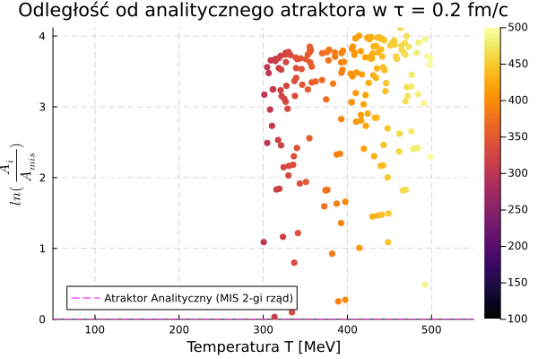

# Witam 
Rzeczy Batchelor Thesis (*star emoji*) related


## Hydrodynamic Attractors in Phase Space
Michał Spaliński, Michał P. Heller, et al...
>Hydrodynamic attractors have recently gained prominence in the context of early stages of ultrarelativistic heavy-ion collisions at the RHIC and LHC. We critically examine the existing ideas on this subject from a phase space point of view. In this picture the hydrodynamic attractor can be seen as a special case of the more general phenomenon of dynamical dimensionality reduction of phase space regions. We quantify this using principal component analysis. Furthermore, we adapt the well known slow-roll approximation to this setting. These techniques generalize easily to higher dimensional phase spaces, which we illustrate by a preliminary analysis of a dataset describing the evolution of a five-dimensional manifold of initial conditions immersed in a 16-dimensional representation of the phase space of the Boltzmann kinetic equation in the relaxation time approximation.
[link do pracy ](https://www.researchgate.net/publication/345364690_Hydrodynamic_Attractors_in_Phase_Space)


## youtube
[link do zapytaj fizyka z helerem](https://www.youtube.com/watch?v=6R2ASA7-g-c&t=9s)

## Źródło różnic w rozwiązaniach równania $A(w)$
[mis_vs_brsss](notes/mis_vs_brsss.md)


## Julia
czego potrzeba do pracy z julia? 
1. [Julia](https://julialang.org/downloads/)
2. Instalowania pakietów w menadżerze pakietów julia (REPL) poprzez wpisanie `]` i potem `add` oraz nazwy pakietu.
```bash
add DifferentialEquations Plots LaTeXStrings
```
3. Ważne by uruchamiać julia w terminal
```bash 
> julia
> include("nazwa_pliku.jl")
```

### Programy napisane w julia 
Programy napisane w julia znajdują się w katalogu [src](/src/).

- [Generowanie danych](src/data_generation/generowanie_AiT.jl) - program generujący ewolucję $A(\tau)$ i $T(\tau)$ dla  warunków początkowych. do pliku .csv
- [Generowanie Danych logarytmicznych](src/data_generation/log_gen.jl) - program generujący ewolucję $A(\tau)$ i $T(\tau)$ dla  warunków początkowych. do pliku .csv w skali logarytmicznej.

- [Analiza wygenerowanych danych](src/A_and_T_evolution.jl)

- [Analiza losowo generowanych Danych ewolucji (A,T)](src/Evolution2.jl) 
> staram się by nie trzebas było omawiać dodatkowo kodu i wszystko było jasne z komentarzy ale jak coś to zapraszam do kontaktu. 
`
## Wygenerowane wykresy
Wszystkie rysunki i wykresy wygenerowane przez kod bede starał się umieszczać w katalogu [images](/images/). Jeśli nie będzie tak żadnego wykresu to zalecam sprawdzenie katalogu [src](/src/) gdzie powinny być wygenerowane wykresy których jeszcze nie przeniosłem. 

## Raport 
### 19.07.2025
- [Evolution of A and T](src/Evolution2.jl) - program do generowania ewolucji $A(\tau)$ i $T(\tau)$ dla losowych warunków początkowych.
-  
>gif z ewolucji $A(\tau)$ i $T(\tau)$ dla losowych warunków początkowych.

> `Na tej wizualizacji widzidać nie tylko aktualny stan systemu (kolorowe punkty), ale także całą jego historię tzn jak zmienia się w czasie. Czerwona linia reprezentuje uniwersalny hydrodynamiczny atraktor $\ln(A_{i}/A_{mis})$. Proszę zwrócić uwagę, jak wszystkie indywidualne trajektorie, startujące z zupełnie różnych miejsc, nieuchronnie zakrzywiają i zbiegają się do tej jednej, czerwonej ścieżki. 
# Reference
